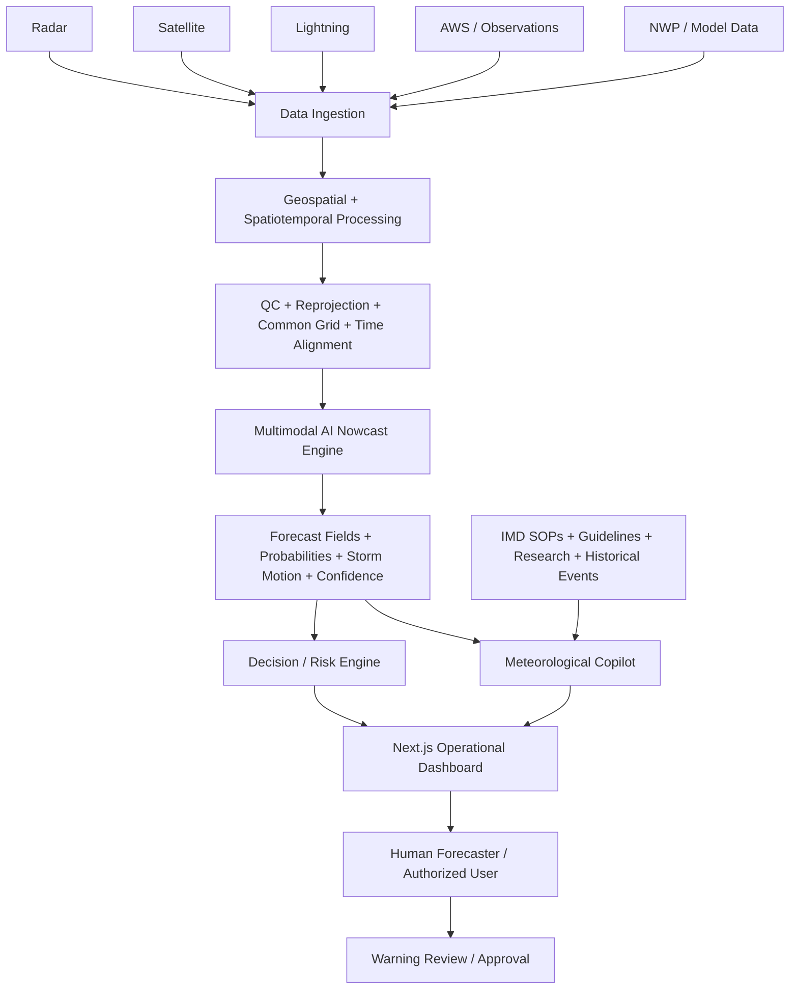
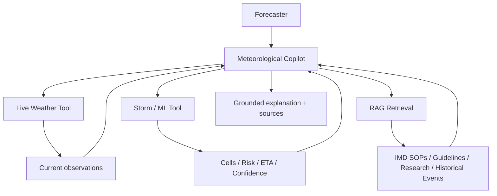
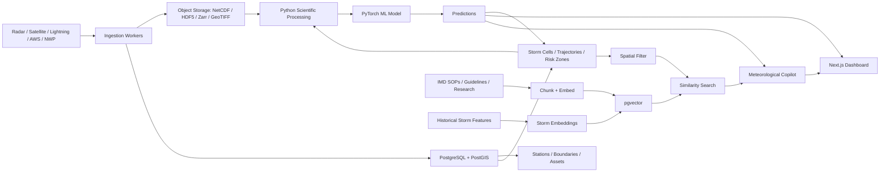

# SIH26072 — AI/ML Thunderstorm & Lightning Nowcasting Platform

## Complete Implementation Plan

---

# Project Overview

**Smart India Hackathon 2026 — SIH26072**
**Problem Statement:** AIML based Nowcasting of thunderstorm and lightning using atmospheric observation including multiple radars, satellite, lightning and model data.
**Organization:** Ministry of Earth Sciences (MoES)
**Department:** India Meteorological Department (IMD)
**Category:** Software
**Theme:** Disaster Management
**Current product direction:** Build an operational thunderstorm/lightning nowcasting and decision-support platform rather than a generic weather application.

---

# 1. What the System Should Actually Solve

The core question is not simply **"Will it rain?"**. The system should answer:

- What is likely to happen in the next **10–60 minutes**?
- Where is the thunderstorm likely to develop or move?
- Where is lightning likely to occur?
- How severe is the threat?
- When is a location likely to be affected?
- How confident is the prediction?
- Which people, districts, roads, hospitals, airports or other critical assets may be exposed?
- What evidence supports the prediction?

The system should be designed as **human-in-the-loop decision support**. AI produces forecasts and evidence; an authorized forecaster remains responsible for operational warning decisions.

> **Important positioning:** IMD already has sophisticated integrated thunderstorm/nowcasting and decision-support workflows. We should not claim that simply combining radar + satellite + lightning + NWP is itself novel. Differentiation should come from the unified ML nowcasting layer, storm-cell tracking, uncertainty, impact/exposure mapping, historical event intelligence, explainability and an optional source-grounded meteorological copilot.

---

# 2. Why We Changed from the Urban-Flooding Problem

An earlier direction was **SIH26085 — urban flooding/drainage**. The major technical blocker was data availability at the level needed for a physics/hydraulic model.

A useful urban drainage model would ideally require pipe-level information such as:
- pipe geometry/diameter
- network topology and connectivity
- invert elevations
- manholes/nodes
- slopes
- outfalls
- catchments
- hydraulic parameters

AMC may have extensive internal GIS/drainage information, but the required pipe-level network data was not readily available as a clearly public dataset/API suitable for the proposed modelling pipeline.

**Decision:** move to SIH26072, where there are multiple relevant atmospheric observation pathways and a much clearer AI/ML research direction, while still requiring verification of historical/archive access for each data source.

---

# 3. Target Users

## Primary User — IMD Meteorological Forecaster

Needs the most detailed scientific interface:
- Radar reflectivity / derived products
- Satellite imagery/products
- Lightning activity
- AWS/observational data
- NWP guidance
- AI nowcast
- Storm cells and trajectories
- Forecast confidence / uncertainty
- Historical event comparison
- Warning drafting/review
- Data-health indicators

## Secondary User — State/District Disaster Management Authority

Needs an operational risk view rather than raw meteorological detail:
- Current threat map
- Affected districts/areas
- Expected arrival time
- Severity/risk category
- Lightning threat
- Exposed population/assets
- Warning status
- Recent evolution

## Emergency Responders

Potential users include SDRF/NDRF, fire services, police/control rooms and other weather-sensitive operations.

Useful information:
- Location-specific threat
- Storm trajectory
- Lightning risk
- ETA
- Safe operational window
- Alerts

## Public Users — Later Phase

A simplified public-facing layer could eventually expose localized warnings, but it should not be the primary product for the SIH solution. The primary value is operational decision support.

---

# 4. High-Level System Architecture



### Concrete Backend Flow

```
DATA SOURCES
  Radar / Satellite / Lightning / AWS / NWP
        ↓
DATA INGESTION
        ↓
GEO-SPATIOTEMPORAL PROCESSING
  QC → reprojection → common grid → temporal alignment
        ↓
AI NOWCAST ENGINE
  Radar encoder
  Satellite encoder
  Lightning encoder
  NWP encoder
  Multimodal fusion
  Temporal prediction
        ↓
PREDICTIONS
  +10/+20/+30/+40/+50/+60 min
  Radar forecast
  Thunderstorm probability
  Lightning probability
  Storm movement vector
  Confidence / uncertainty
        ↓
DECISION ENGINE
  Risk / Severity / ETA / Exposure / Alert state
        ↓
NEXT.JS APPLICATION
  Map / Timeline / Storm Cells / Alerts / Analytics
```

---

# 5. Core Architectural Principle: Separate ML from Decisions

The **ML engine** should not directly issue official warnings.

### ML Engine

Produces scientifically measurable outputs such as:
- future reflectivity
- thunderstorm probability
- lightning probability
- storm movement vector
- intensity trend
- confidence/uncertainty

### Decision Engine

Converts model outputs into operational information:
- risk level
- expected arrival time
- affected area
- exposure
- warning threshold state
- alert recommendation/draft

### Human Approval

```
AI detects elevated risk
        ↓
Decision engine generates draft warning context
        ↓
Forecaster reviews evidence + uncertainty
        ↓
Forecaster approves / edits / dismisses
        ↓
Warning is disseminated
```

This architecture avoids treating a generative model or RAG system as the authority for safety-critical prediction.

---

# 6. Data Sources and Data Strategy

## Radar

Potential sources include IMD radar services and MOSDAC DWR products.

One previously identified example is the TERLS DWR dataset/product with 3D volumetric information, including a grid described as **81 × 481 × 481**, approximately **1 km horizontal resolution**, **250 m vertical resolution**, and coverage up to roughly **20 km**.

Radar is likely to be the most important input for the initial nowcasting model because it directly captures precipitation/storm structure and motion.

Useful radar variables/products may include:
- Reflectivity
- Radial velocity
- Spectrum width
- Derived products
- Volumetric radar fields where available

## Satellite

Potential sources include INSAT-3D / 3DR / 3DS and MOSDAC products.

Useful variables/products may include:
- Infrared imagery
- Water-vapour imagery
- Visible imagery
- Cloud properties
- Cloud-top temperature / related derived products

Satellite becomes particularly useful for storm development, cloud evolution and areas with weaker radar coverage.

## Lightning

Potential sources discussed:
- IMD Lightning API/services
- IITM Lightning Location Network (ILDN)

Potential features:
- Lightning strike locations
- Flash density
- Flash-rate trend
- Spatial clustering
- Rapid increase in lightning activity

Historical raw lightning archive availability still needs to be concretely verified before committing the training plan.

## AWS / Atmospheric Observations

Potential observational inputs:
- Surface temperature
- Relative humidity
- Pressure
- Wind speed/direction
- Rainfall
- Other station observations where available

These can provide local thermodynamic and surface context.

## NWP / Model Data

NWP can provide broader atmospheric context and environmental evolution.

The exact model/dataset and historical access path still need to be verified.

Potential variables:
- Temperature profiles
- Humidity
- Wind fields
- CAPE/CIN and other instability indicators where available
- Pressure/geopotential fields
- Precipitation guidance
- Vertical profiles

---

# 7. Data Engineering Pipeline

All modalities have different:
- spatial resolutions
- projections
- coordinate systems
- timestamps
- update frequencies
- file formats

Therefore, the first major engineering problem is **spatiotemporal harmonization**.

### Recommended Canonical Process

```
Raw source
   ↓
Ingestion
   ↓
Quality control
   ↓
Decode / parse
   ↓
Reproject
   ↓
Resample to common spatial grid
   ↓
Align to canonical time step
   ↓
Normalize / standardize
   ↓
Create multimodal tensor/sample
   ↓
Store training/inference-ready data
```

A reasonable starting point is a **10-minute canonical time step**, subject to the actual temporal resolution of the selected data sources.

### Potential Scientific/Data Tools

- Python
- NumPy
- xarray
- Rasterio
- SciPy
- GDAL
- PyTorch
- NetCDF/HDF5/Zarr/GeoTIFF/Parquet depending on source

---

# 8. Training Sample Design

A basic supervised training sample can be structured as:

```
INPUT WINDOW
T-60
T-50
T-40
T-30
T-20
T-10
T

        ↓

MODEL

        ↓

TARGETS
T+10
T+20
T+30
T+40
T+50
T+60
```

The exact window length and timestep should be determined by data availability and experiments.

The goal is to learn the evolution of storm systems rather than simply classify a single snapshot.

---

# 9. ML Development Strategy

Do not start with an extremely complex multimodal architecture. Build progressively.

## Baseline 0 — Persistence

Assume the current radar/storm state remains approximately unchanged.

This is important because a sophisticated model is only useful if it beats a simple baseline.

## Baseline 1 — Radar-Only Model

Possible architectures:
- ConvLSTM
- U-Net-style encoder/decoder
- Spatiotemporal CNN
- Other video-prediction architectures

Goal: establish a measurable radar nowcasting baseline.

## Model 2 — Multimodal Fusion

Add:
- Satellite
- Lightning
- AWS
- NWP

Possible structure:

```
Radar encoder       ─┐
Satellite encoder   ─┤
Lightning encoder   ─┼→ Fusion → Temporal model → Prediction heads
AWS encoder         ─┤
NWP encoder         ─┘
```

Do not assume that every modality improves performance. Validate each addition experimentally.

---

# 10. Model Outputs

The system should produce several operational outputs rather than a single "storm/no storm" label.

### Forecast Reflectivity

Predicted radar-like fields for future timestamps.

### Thunderstorm Probability

Spatial probability that thunderstorm conditions will occur within each forecast horizon.

### Lightning Probability

Spatial probability of lightning occurrence.

### Storm-Cell Movement

Estimate:
- position
- direction
- speed
- intensity
- growth/decay

### Confidence / Uncertainty

The system should expose calibrated probability or uncertainty information where possible.

Avoid fake "AI confidence = 93%" UI values that are not actually calibrated or derived from the model.

---

# 11. Storm-Cell Intelligence

This should be a major product feature.

Instead of showing only a generic heatmap, detect and track individual storm cells.

### Example Object

```
Cell ID: C-1042
Current location: Gujarat region
Direction: NE
Speed: 38 km/h
Current intensity: Severe
Lightning trend: Increasing
Forecast:
  +15 min → location A
  +30 min → location B
  +45 min → location C
  +60 min → location D
Trajectory confidence: calibrated model output
```

### On the Map, Show:

- current cell
- predicted trajectory
- future positions
- uncertainty corridor
- intensity trend
- lightning activity

---

# 12. Timeline / Replay Feature

A historical event replay can make the system much more useful for both evaluation and demonstration.

```
Observed radar
      ↓
Storm develops
      ↓
Satellite evolution
      ↓
Lightning increases
      ↓
AI forecast generated
      ↓
Actual storm path
      ↓
Compare prediction vs reality
```

The UI can allow the user to move a time slider through an event.

This provides a strong way to demonstrate that the system is doing **nowcasting**, not simply displaying current weather data.

---

# 13. Explainability — "Why Is the System Warning?"

The interface can expose evidence behind an elevated-risk prediction.

Possible signals:
- Increasing radar reflectivity
- Rapid cell growth
- Increasing lightning density/flash rate
- Cloud-top cooling
- Wind convergence
- Thermodynamic instability
- NWP environmental support

However, these explanations must be tied to actual model analysis, ablation studies, saliency/attention methods, feature perturbation or other validated techniques. Do not fabricate feature importance merely to make the UI look intelligent.

---

# 14. Impact and Exposure Layer

Meteorological prediction becomes more operationally useful when combined with geographic exposure.

### Potential Layers

- Population
- Hospitals
- Schools
- Airports
- Highways
- Railway infrastructure
- Power infrastructure
- Emergency facilities
- Other critical infrastructure

### Example

```
Storm trajectory
      +
Risk probability
      +
Geospatial exposure
      ↓
Potentially affected assets / districts
```

This is particularly useful for disaster-management authorities and responders.

---

# 15. Data Health / System Health

The dashboard should clearly communicate whether inputs are available and fresh.

### Example

```
Radar       LIVE
Satellite   LIVE
Lightning   LIVE
AWS         LIVE
NWP         STALE
Model       READY
```

### Also Track

- last update timestamp
- missing data
- input quality
- model availability
- inference latency

This prevents users from blindly trusting a prediction produced from incomplete inputs.

---

# 16. Multimodal Comparison / Ablation View

A strong research-oriented feature is to compare model configurations.

### Example

```
Radar only
vs
Radar + Satellite
vs
Radar + Satellite + Lightning
vs
Radar + Satellite + Lightning + NWP
```

The UI should only present this as evidence after actual evaluation.

This can help demonstrate the value of multimodal data scientifically.

---

# 17. Historical Event Intelligence

Maintain a searchable historical storm/event database.

For a current storm, represent the event using numerical/spatiotemporal characteristics and find similar historical events.

### Potential Workflow

```
Current storm
   ↓
Feature representation
   ↓
Similarity search
   ↓
Top historical events
   ↓
Compare evolution
   ↓
Generate contextual summary
```

### This Can Support

- Forecaster learning
- Event analysis
- Model evaluation
- Research
- Explainability

A vector database or `pgvector` can be considered for similarity retrieval, but this is separate from the core weather prediction model.

---

# 18. RAG — Honest Assessment

## Is RAG Needed for the Core Problem?

**No.** RAG should not be part of the core numerical nowcasting pipeline.

### Bad Architecture

```
Radar → Vector DB → RAG → LLM → Thunderstorm prediction
```

Radar, satellite, lightning and NWP are numerical/geospatial/time-series data. Their prediction problem should be handled by scientific preprocessing and spatiotemporal ML.

RAG is much better suited to retrieving and grounding **textual knowledge**.

## Where RAG Does Make Sense

Use RAG as a secondary **Meteorological Copilot** layer after the prediction engine.

```
Weather observations
        ↓
ML Nowcast
        ↓
Decision Engine
   ├───────────────┐
   ↓               ↓
Forecast output   RAG / Copilot
                  ├─ IMD SOPs
                  ├─ Operational guidelines
                  ├─ Disaster-management guidance
                  ├─ Meteorological research
                  └─ Historical event records
   └───────────────┬───────────────┘
                   ↓
            Human Forecaster
                   ↓
                 Alert
```

## What the Copilot Can Answer

- "Why is this area currently considered high risk?"
- "What observations support this warning?"
- "What does the relevant IMD SOP say about this warning situation?"
- "Show similar historical thunderstorm events."
- "Why is lightning risk increasing?"
- "What changed in the last 30 minutes?"

## Important Boundary

Live meteorological values should be obtained from **structured tools/APIs**, not embedded into a vector database and treated as static documents.

The LLM can call:

```
Weather tool → current observations
Storm tool → ML cells/risk/ETA
RAG → documents/guidelines/history
```

Then it produces a grounded explanation with source references.

## RAG Must Not Issue the Official Warning

```
ML model
   ↓
Decision engine
   ↓
Evidence/context
   ↓
Human forecaster
   ↓
Official warning
```

RAG/LLM is an assistant, not the authoritative forecasting system.

---

# 19. Recommended Meteorological Copilot Architecture



The copilot should answer from three distinct information classes:

1. **Live data** — structured weather/storm tools
2. **Knowledge** — RAG over trusted documents
3. **Model output** — structured ML predictions

---

# 20. Suggested Technology Stack

## Frontend
- Next.js
- TypeScript
- Tailwind CSS
- Interactive geospatial map
- WebSocket/SSE client for live updates

## Backend/API
- FastAPI
- Python
- REST APIs for historical/query workflows
- WebSocket for real-time updates

## Scientific/ML
- NumPy
- xarray
- Rasterio
- SciPy
- GDAL
- PyTorch
- NetCDF/HDF5/Zarr as appropriate

## Database
- PostgreSQL
- PostGIS for geospatial metadata/queries
- Optional `pgvector` for historical-event/document similarity

## Storage
Object storage for large scientific datasets and model artifacts.

Potential formats:
- NetCDF
- HDF5
- Zarr
- GeoTIFF
- Parquet

## ML Serving
Keep inference separate from the web application where practical.

Possible services:

```
Ingestion workers
       ↓
Preprocessing service
       ↓
ML inference service
       ↓
Decision engine
       ↓
FastAPI
       ↓
Next.js
```

---

# 21. Frontend Architecture Concept

```
app/
  page.tsx
  dashboard/
    page.tsx

components/
  map/
    WeatherMap.tsx
    RadarLayer.tsx
    LightningLayer.tsx
    SatelliteLayer.tsx
    StormCells.tsx
    ForecastLayer.tsx
    ExposureLayer.tsx
  timeline/
    ForecastTimeline.tsx
    EventReplay.tsx
  panels/
    RiskPanel.tsx
    StormDetails.tsx
    ModelConfidence.tsx
    DataHealth.tsx
    CopilotPanel.tsx
  charts/
    ForecastChart.tsx
    LightningTrend.tsx
    IntensityTrend.tsx
```

The exact structure can change after API/data contracts are finalized.

---

# 22. User Interface by Role

## Forecaster Dashboard

Main layout:

```
┌──────────────────────────────────────────────────────────┐
│ System/Data Health                                       │
├──────────────────────────────────────────────────────────┤
│                                                          │
│                    Interactive Map                       │
│                                                          │
│      Storm cells + radar + lightning + forecast         │
│                                                          │
├──────────────────────┬───────────────────────────────────┤
│ Storm Details        │ Risk / Confidence / Evidence     │
├──────────────────────┴───────────────────────────────────┤
│ Timeline / Replay / +10 +20 +30 +40 +50 +60 min         │
└──────────────────────────────────────────────────────────┘
```

## Disaster-Management Dashboard

Focus on:
- Risk map
- Districts
- ETA
- Severity
- Exposure
- Warning state

Hide unnecessary raw scientific detail.

## Responder Dashboard

Focus on:
- Current location
- Threat direction
- Lightning risk
- ETA
- Operational safety window
- Nearby critical assets

---

# 23. RBAC

### Potential Roles

| Role | Main Capabilities |
|------|-------------------|
| Admin | Users, system configuration, data/model health |
| Forecaster | Full scientific dashboard, review/approve warnings |
| Disaster Authority | Risk/exposure dashboard, warning information |
| Responder | Location-specific operational threat information |

The role model can be implemented with application-level authentication/authorization and backend permission checks.

---

# 24. Real-Time Architecture

The system should behave like an operational pipeline rather than a page that users manually refresh.

```
New radar/satellite/lightning data
        ↓
Ingestion event
        ↓
QC + preprocessing
        ↓
Feature/tensor update
        ↓
ML inference
        ↓
Storm-cell update
        ↓
Risk/exposure calculation
        ↓
Persist latest state
        ↓
Push update via WebSocket/SSE
        ↓
Dashboard updates automatically
```

### Potential Real-Time Objects

- latest radar timestamp
- latest satellite timestamp
- latest lightning timestamp
- storm cells
- trajectories
- forecast probabilities
- risk areas
- alerts/warning drafts

---

# 25. Evaluation Strategy

The project needs quantitative evaluation, not only a visually impressive dashboard.

## Radar/Forecast Field Metrics

Potential metrics:
- RMSE
- MAE
- CSI
- FSS

## Thunderstorm Classification

Potential metrics:
- Precision
- Recall
- F1
- PR-AUC

## Lightning Prediction

Potential metrics:
- Probability of Detection (POD)
- False Alarm Ratio (FAR)
- CSI

## Baseline Comparisons

At minimum compare against:
1. Persistence
2. Radar-only ML model
3. Multimodal model

Where possible, evaluate across multiple forecast horizons, e.g. +10 to +60 minutes.

---

# 26. MVP Scope

Do **not** attempt to build the entire India operational system immediately.

Start with a manageable geographic region covered by a usable radar/data stack.

A possible MVP region is **Gujarat/Ahmedabad**, provided the required data can be accessed and archived.

### MVP Priorities (Phase 1)

- [ ] Verify historical access for each selected data source
- [ ] Select initial geographic region
- [ ] Establish common spatial grid
- [ ] Establish canonical time step
- [ ] Build radar preprocessing
- [ ] Build persistence baseline
- [ ] Build radar-only nowcasting baseline
- [ ] Build storm-cell detection/tracking
- [ ] Build +10 to +60 minute forecast outputs
- [ ] Build interactive map
- [ ] Build forecast timeline
- [ ] Add lightning layer
- [ ] Add uncertainty/confidence representation
- [ ] Add decision/risk layer
- [ ] Add data-health indicators
- [ ] Add human-in-the-loop warning workflow

### Phase 2

- [ ] Satellite fusion
- [ ] Lightning fusion into ML model
- [ ] AWS fusion
- [ ] NWP fusion
- [ ] Historical event intelligence
- [ ] Exposure/critical infrastructure layers
- [ ] Event replay
- [ ] Multimodal ablation comparison

### Phase 3 — Optional Differentiator

- [ ] Meteorological Copilot
- [ ] RAG over trusted documents
- [ ] Tool calling for live data and ML outputs
- [ ] Source-grounded explanations
- [ ] Historical event similarity + RAG summary

---

# 27. Feature Prioritization

## Critical

- Radar processing
- Satellite processing where feasible
- Lightning data processing
- Temporal ML
- Multimodal fusion
- Storm-cell tracking
- Risk/decision engine
- Visualization

## High Priority

- Historical event analysis
- Human-in-the-loop alert workflow
- Uncertainty/confidence
- Data health
- Impact/exposure mapping

## Optional

- RAG
- LLM chatbot/copilot
- Advanced conversational interface

**If time is limited, build the forecasting engine first and add RAG only after the core nowcasting workflow works.**

---

# 28. What Should Make the Project Distinctive

Potential differentiators:

1. **Multimodal spatiotemporal nowcasting** rather than a generic weather dashboard.
2. **Storm-cell-level tracking** rather than only area heatmaps.
3. **Trajectory + ETA** for operational decision-making.
4. **Uncertainty-aware forecasting** rather than a single deterministic prediction.
5. **Impact/exposure mapping** connecting meteorology to infrastructure and population.
6. **Historical event intelligence** for context and learning.
7. **Explainable evidence** showing what signals contributed to a warning.
8. **Human-in-the-loop warning workflow** instead of autonomous safety-critical decisions.
9. **Optional Meteorological Copilot** grounded in authoritative documents and live model outputs.

---

# 29. Current Research/Official-Source Notes

The following official IMD material informed the architecture discussion and should be re-checked during implementation because operational systems and data access can change.

### IMD Nowcast Services

[https://mausam.imd.gov.in/responsive/pilgrimage_nowcast.php](https://mausam.imd.gov.in/responsive/pilgrimage_nowcast.php)

IMD provides operational nowcast-related services including district/station-level products and thunderstorm-related information.

### IMD Annual Report 2023

[https://mausam.imd.gov.in/imd_latest/contents/ar2023.pdf](https://mausam.imd.gov.in/imd_latest/contents/ar2023.pdf)

The report describes a **Thunderstorm Decision Support System (TDSS)** integrating observational data including lightning, satellite/radar tools, mesoscale/nowcast model products and climatological indices, supporting forecasters and impact-based warnings.

### IMD Forecasting SOP

[https://mausam.imd.gov.in/imd_latest/contents/pdf/forecasting_sop.pdf](https://mausam.imd.gov.in/imd_latest/contents/pdf/forecasting_sop.pdf)

The nowcasting SOP discusses digital observations such as AWS/AWOS/GPS/ARG/wind profiler/lightning/radiosonde/synoptic observations, satellite products, radar products, NWP guidance and automatic nowcast products.

### IMD Thunderstorm Forecasting / Warning Report, January 2025

[https://internal.imd.gov.in/press_release/20250114_pr_3552.pdf](https://internal.imd.gov.in/press_release/20250114_pr_3552.pdf)

The documented process includes climatology, recent weather, model forecasts, thermodynamic indices, surface/upper-air observations, mesoscale models, lightning, satellite, radar, crowdsourced/social reports and impact information, followed by impact-based warnings, dissemination and post-event analysis/feedback.

### IMD 2025 Nowcasting Strategy / Monsoon Report

[https://mausam.imd.gov.in/imd_latest/monsoon_report_2025_2.pdf](https://mausam.imd.gov.in/imd_latest/monsoon_report_2025_2.pdf)

Contains information on operational nowcasting strategy and station/district-level nowcast services.

### IMD Nowcast Services Brochure

[https://mausam.imd.gov.in/imd_latest/contents/pdf/pubbrochures/NowcastServices%20of%20IMD.pdf](https://mausam.imd.gov.in/imd_latest/contents/pdf/pubbrochures/NowcastServices%20of%20IMD.pdf)

Discusses systems/products including radar-based SWIRLS, SCOPE nowcasting and WRF-HRRR guidance.

---

# 30. Important Claims to Avoid

Do not claim:
- "We are the first system to combine radar, satellite and lightning."
- "Our RAG predicts thunderstorms."
- "The LLM issues warnings."
- "AI replaces meteorologists."
- "The model is highly accurate" without quantitative evaluation.
- "Confidence is 95%" unless the probability is actually calibrated.
- "All India real-time coverage" unless the full data/infrastructure chain has been demonstrated.

A stronger and defensible framing is:

> **A multimodal AI-driven operational decision-support platform for short-horizon thunderstorm and lightning nowcasting, combining atmospheric observations with spatiotemporal forecasting, storm-cell tracking, uncertainty estimation and impact-aware warning support.**

---

# 31. Immediate Next Steps

The next planning stage should happen in this order:

1. **Finalize user journeys** for Forecaster, Disaster Authority and Responder.
2. **Freeze the system module boundaries.**
3. **Verify exact data access and archival availability** for radar, satellite, lightning, AWS and NWP.
4. **Choose the initial geographic MVP region.**
5. **Define canonical spatial/temporal data contracts.**
6. **Design database schema and API contracts.**
7. **Build the persistence baseline.**
8. **Build radar-only model.**
9. **Add storm-cell detection/tracking.**
10. **Add multimodal fusion incrementally and measure the gain from each modality.**
11. **Build decision/risk/exposure layer.**
12. **Build the operational Next.js dashboard.**
13. **Add historical replay/evaluation.**
14. **Add RAG/Meteorological Copilot only after the forecasting core is functional.**

---

# 32. One-Line Architecture Summary

```
Observations → Spatiotemporal Processing → Multimodal ML Nowcast → Storm Cells/Uncertainty → Risk & Exposure Engine → Operational Dashboard → Human Review → Warning
                                                            ↘ Meteorological Copilot (RAG + tools)
```

**Core principle:** the science/ML pipeline predicts; the decision engine operationalizes; the copilot explains and retrieves knowledge; the human remains in control of official warnings.

---

# 33. Clearly Defined Product Goal

## One-Sentence Goal

**Build an operational AI decision-support system that predicts the location, movement, intensity and lightning risk of thunderstorms 10–60 minutes ahead by fusing radar, satellite, lightning, atmospheric observations and model data, then converts those predictions into explainable, location-aware risk information for authorized forecasters and disaster-response users.**

## What Success Looks Like

A forecaster should be able to open the system and answer, in one workflow:

1. **Where are the active storm cells?**
2. **Where will each cell move in the next 10–60 minutes?**
3. **Where is lightning likely to occur?**
4. **How severe is the expected threat?**
5. **What is the expected arrival time at a selected location?**
6. **How certain is the prediction?**
7. **What observations/model signals support it?**
8. **Which districts or critical assets may be exposed?**
9. **What operational guidance or historical cases are relevant?**

## What the Product Is NOT

- Not a generic weather application.
- Not a chatbot that predicts storms from text.
- Not an LLM-based replacement for meteorological forecasting.
- Not a system where RAG generates the numerical forecast.
- Not an automatic official-warning authority.

---

# 34. Feature Definition — Core vs Advanced

## Tier 1 — Essential MVP

### 1. Multi-Source Ingestion
Ingest and normalize the selected:
- Radar
- Satellite
- Lightning
- AWS/observations
- NWP/model data

### 2. Common Geospatial-Temporal Grid
Convert heterogeneous sources into a common spatial reference, grid and timestep so they can be fused by the ML pipeline.

### 3. Radar Nowcasting Baseline
Predict future radar/reflectivity fields for +10 to +60 minutes.

### 4. Thunderstorm Probability Map
Generate a spatial probability field for thunderstorm occurrence at each forecast horizon.

### 5. Lightning Probability Map
Generate a spatial probability field for lightning risk.

### 6. Storm-Cell Detection and Tracking
Detect individual storm objects and maintain their identity across timesteps.

### 7. Storm Trajectory
Show current and predicted positions for each tracked cell at +15/+30/+45/+60 minutes.

### 8. Risk/Decision Layer
Convert model outputs into operational risk information such as risk category, ETA and affected area.

### 9. Operational Map Dashboard
Map-first UI showing:
- Current observations
- Forecast layers
- Storm cells
- Trajectories
- Lightning
- Risk zones
- Selected exposure layers

### 10. Timeline
Allow users to switch between observation time and forecast horizons.

### 11. Data/Model Health
Show freshness and availability of every input source and model state.

### 12. Human Review Workflow
AI generates forecast/risk context → authorized forecaster reviews → approves, edits or dismisses a warning recommendation.

---

## Tier 2 — Strong Differentiators

### 13. Prediction Uncertainty
Display calibrated probability/uncertainty and trajectory corridors rather than arbitrary confidence percentages.

### 14. Impact/Exposure Mapping
Intersect forecast risk with:
- Population
- Hospitals
- Schools
- Airports
- Roads
- Railways
- Power/critical infrastructure
- Emergency facilities

### 15. Historical Event Replay
Replay past storms from observations through prediction and compare predicted vs actual evolution.

### 16. Historical Event Similarity
Find past storms with similar spatial, temporal and intensity characteristics.

### 17. Multimodal Ablation/Comparison
Compare validated model configurations to demonstrate the contribution of different data sources.

### 18. Explainable Warning Evidence
Show scientifically supported factors contributing to the prediction, backed by model analysis rather than fabricated explanations.

---

## Tier 3 — Meteorological Copilot

### 19. Source-Grounded RAG
Retrieve and cite:
- IMD SOPs
- Operational guidelines
- Disaster-management guidelines
- Meteorological research
- Historical event documentation

### 20. Live Weather Tools
The copilot should call structured APIs/services for current radar, lightning and model state instead of embedding live numerical data into a vector store.

### 21. Forecaster Questions
Examples:
- "Why is the risk increasing over this region?"
- "What observations support the current warning?"
- "Show similar historical storms."
- "What does the applicable operational guidance say?"
- "Summarize the evolution of this storm over the last hour."

### 22. Grounded Answer with Evidence
The copilot should distinguish:
- Current measured observations
- ML predictions
- Retrieved documents
- Historical analogues
- LLM-generated explanation

It must never silently turn retrieved text into a new numerical prediction.

---

# 35. PostgreSQL + Supabase + PostGIS + pgvector Architecture

## The Important Distinction

There are **three different kinds of "vectors"** in this system:

| Type | Example | Correct Storage/Processing |
|------|---------|---------------------------|
| Geospatial vector | Storm point, district polygon, storm trajectory LineString | **PostGIS geometry/geography** |
| ML/semantic embedding | Embedding of an IMD SOP paragraph or historical storm representation | **pgvector** |
| Scientific tensor/raster | Radar volume, satellite image, gridded forecast field | **Object storage / scientific files + Python ML pipeline** |

Do **not** put all three into one generic "vector database". They represent fundamentally different mathematical objects.

Supabase supports both PostGIS for geographic data and pgvector for embeddings. PostGIS provides spatial types and spatial queries; pgvector stores high-dimensional numerical embeddings and supports similarity search.

---

# 36. What PostGIS Should Store

PostGIS should become the **geospatial operational database** for the application.

### A. Administrative Boundaries

```
countries
states
  districts
```

Each record can contain a polygon/multipolygon.

### B. Observation Locations

```
radar_sites
aws_stations
lightning_sensors
weather_stations
```

Each record contains a Point geometry/geography.

### C. Critical Infrastructure

```
hospitals
schools
airports
highways
railways
power_assets
emergency_facilities
```

Each asset can be a Point, LineString or Polygon.

### D. Storm Cells

```
storm_cells
```

Store the current storm footprint/centroid and associated metadata.

Example conceptual row:

```
cell_id
observed_at
geom
intensity
lightning_rate
movement_speed
movement_direction
risk_score
model_run_id
```

### E. Forecast Trajectories

```
storm_cell_forecasts
```

Possible geometry:
- Point for predicted cell centre at a specific horizon
- Polygon for predicted footprint
- LineString for trajectory
- Polygon corridor for uncertainty

Example:

```
cell_id
forecast_time
horizon_minutes
forecast_geom
uncertainty_geom
probability
model_version
```

### F. Risk Zones

Store generated operational polygons where appropriate:

```
risk_zones
```

Example:

```
risk_level
valid_from
valid_to
geom
probability
model_version
```

---

# 37. Geometry vs Geography

For a local/regional forecasting system, **PostGIS geometry with an appropriate projected CRS is generally preferable for computational geospatial operations** because planar calculations are usually faster and expose the full geometry function set. Geography is useful when working directly with global latitude/longitude and spheroidal distance calculations.

### Recommended Approach

```
Raw lat/lon input
      ↓
Store canonical geographic coordinates / source CRS metadata
      ↓
Transform into an appropriate regional projected CRS for heavy spatial analysis
      ↓
Run spatial operations using geometry
```

The exact CRS should be selected based on the geographic domain and model grid.

---

# 38. PostGIS Spatial Queries We Actually Need

### Find Assets Inside a Storm Risk Polygon

```sql
SELECT a.id, a.name
FROM critical_assets a
JOIN risk_zones r
  ON ST_Intersects(a.geom, r.geom)
WHERE r.risk_level = 'HIGH';
```

### Find Storms Near a Location

```sql
SELECT *
FROM storm_cells
WHERE ST_DWithin(
  geom,
  ST_SetSRID(ST_MakePoint(:lon, :lat), 4326),
  :radius
);
```

### Find Districts Intersecting a Forecast Area

```sql
SELECT d.id, d.name
FROM districts d
JOIN forecast_areas f
  ON ST_Intersects(d.geom, f.geom);
```

Use GiST spatial indexes on frequently queried geometry columns.

---

# 39. What pgvector Should Store

`pgvector` is for **embeddings**, not geographic geometry.

Use it for two main use cases.

## Use Case A — RAG Knowledge Base

Store embeddings for chunks of:
- IMD SOP documents
- Disaster-management guidelines
- Meteorological research papers
- Operational manuals
- Relevant technical documentation

Conceptual table:

```
knowledge_documents
-------------------
id
source
title
content
chunk_index
embedding
metadata
created_at
```

The `embedding` column uses the PostgreSQL `vector` type.

## Use Case B — Historical Storm Similarity

A historical storm can be converted into a numerical representation describing its evolution, for example:

```
storm intensity evolution
lightning-rate evolution
movement vector
size evolution
spatial pattern
environmental context
forecast trajectory characteristics
```

A model can convert that representation into an embedding.

Store:

```
historical_storms
-----------------
id
event_time
region
summary
feature_metadata
embedding
geom
```

Here the row can contain **both**:
- `geom` → PostGIS spatial representation
- `embedding` → pgvector similarity representation

That combination is extremely useful.

---

# 40. The Powerful Part: PostGIS + pgvector Together

This is where Supabase becomes particularly useful for this project.

Imagine the forecaster selects a storm near Ahmedabad.

We do NOT simply search every historical storm using embeddings.

Instead:

```
Current storm
     ↓
PostGIS spatial filtering
     ↓
Relevant geographic region / time period
     ↓
pgvector similarity search
     ↓
Top historical analogues
     ↓
RAG/LLM summarizes the retrieved cases
```

This is **hybrid retrieval**.

### Example

```
Question:
"Show historical storms similar to this cell."

Step 1 — spatial filter
Find historical storms within relevant geographic domain.

Step 2 — vector similarity
Compare current storm embedding against historical storm embeddings.

Step 3 — metadata filter
Filter by season, region, intensity, etc.

Step 4 — retrieve source material
Fetch reports/case studies associated with those events.

Step 5 — LLM
Generate a source-grounded comparison.
```

This is much more defensible than blindly asking an LLM to infer similarities.

---

# 41. What Should NOT Go Into pgvector

Do **not** embed every radar pixel and expect pgvector to become the ML engine.

### Avoid

```
Radar image
  ↓
Embedding
  ↓
pgvector
  ↓
Nearest neighbour
  ↓
Storm forecast
```

That throws away the structure of the spatiotemporal field that the forecasting model needs.

Radar/satellite data should remain in scientific formats and be processed by the ML pipeline.

The ML model should learn from tensors such as:

```
[BATCH, TIME, CHANNELS, HEIGHT, WIDTH]
```

or other appropriate 3D/4D representations.

PostgreSQL is the **metadata, operational, geospatial and retrieval layer**, not the replacement for the scientific data lake or GPU tensor pipeline.

---

# 42. Recommended Complete Data Architecture



---

# 43. Recommended Supabase Database Structure

A practical first schema could be:

```
public/
├── profiles
├── roles
├── radar_sites
├── weather_stations
├── administrative_regions
├── critical_assets
├── model_runs
├── storm_cells
├── storm_cell_observations
├── storm_cell_forecasts
├── risk_zones
├── alerts
├── alert_reviews
├── historical_storms
├── historical_storm_features
└── knowledge_documents

extensions/
├── postgis
└── vector
```

### Example Relationships

```
model_runs
   │
   ├── storm_cell_forecasts
   │       └── risk_zones
   │
   └── predictions metadata

storm_cells
   ├── observations
   └── forecasts

historical_storms
   ├── spatial geometry
   ├── numerical features
   └── embedding

knowledge_documents
   ├── document metadata
   ├── chunks
   └── embeddings
```

---

# 44. Where Supabase Fits — and Where It Does Not

### Supabase Is Excellent For

- Application database
- Users/RBAC
- Alert state
- Forecast metadata
- Storm-cell metadata
- Geospatial queries
- Infrastructure exposure queries
- Historical event metadata
- RAG documents and embeddings
- Similarity search
- Audit trail for human warning decisions
- Realtime UI updates

### Supabase Should NOT Be the Primary Store For

- Huge raw radar archives
- Massive satellite image collections
- GPU training tensors
- Every pixel of every forecast frame
- High-volume scientific raster history

Use object/scientific storage for those datasets and keep PostgreSQL references/metadata to them.

---

# 45. End-to-End Request Example

Suppose the user selects a hospital on the map.

```
Next.js
   ↓
FastAPI
   ↓
Supabase/PostGIS
   ↓
Find storm cells within radius
   ↓
Find forecast trajectories intersecting hospital area
   ↓
Retrieve +15/+30/+45/+60 minute probabilities
   ↓
Decision engine
   ↓
Return:
  current risk
  expected arrival time
  lightning probability
  storm cell ID
  uncertainty
  evidence references
   ↓
Next.js renders the result
```

### For a Copilot Question

```
User:
"Why is this hospital under high lightning risk?"

        ↓

Copilot
   ├── Weather tool → current ML prediction
   ├── PostGIS → hospital/storm spatial relationship
   ├── pgvector → relevant IMD guidance
   └── Historical search → similar events
        ↓

Grounded response
        ↓

Forecaster
```

---

# 46. Final Architecture Decision

The clean architecture for this project is:

```
          ┌─────────────────────────┐
          │     NEXT.JS FRONTEND    │
          │ Map / Timeline / Alerts │
          └────────────┬────────────┘
                       │
                 API / WebSocket
                       │
          ┌────────────▼────────────┐
          │       FASTAPI API       │
          └──────┬─────────┬────────┘
                 │         │
      ┌──────────▼──┐   ┌─▼────────────────┐
      │ Decision    │   │ Meteorological   │
      │ Engine      │   │ Copilot          │
      └──────┬──────┘   └───────┬──────────┘
             │                  │
      ┌──────▼──────┐      ┌────▼──────┐
      │ ML Inference│      │ pgvector  │
      │ PyTorch     │      │ RAG       │
      └──────┬──────┘      └───────────┘
             │
  ┌──────────▼───────────┐
  │ Supabase PostgreSQL  │
  │ PostGIS + pgvector   │
  └──────────┬───────────┘
             │
┌────────────▼─────────────┐
│ Object / Scientific Data │
│ NetCDF / Zarr / HDF5 etc │
└──────────────────────────┘
```

### Core Rules

> **PostGIS answers "where?"**
>
> **pgvector answers "what is semantically/similarly related?"**
>
> **The ML model answers "what is likely to happen next?"**
>
> **The decision engine answers "what does that mean operationally?"**
>
> **The copilot answers "what evidence and guidance help the human understand it?"**

That separation should be preserved throughout the implementation. It keeps the system scientifically defensible while still giving Supabase a meaningful role in the architecture.

---

# Easy Explanation — Simplified System Overview

## 1. The Basic Idea

Think of the whole system as a pipeline that takes different kinds of weather data, cleans and combines them, runs an AI model, and turns the prediction into something a forecaster can use.

```
RAW WEATHER DATA
      ↓
Collect
      ↓
Clean + Check
      ↓
Put everything on the same map + time
      ↓
Create ML input
      ↓
AI/ML prediction
      ↓
Detect + track storms
      ↓
Calculate risk + ETA
      ↓
Store results
      ↓
Show on dashboard
      ↓
Forecaster reviews
```

## 2. What Data Do We Have?

We use five major types of weather data.

### Radar
Radar tells us what is happening inside the atmosphere right now. For ML, radar is essentially a spatial numerical grid changing over time.

### Satellite
Satellite gives us a view from space. It can provide infrared, water-vapour, visible imagery, cloud properties and cloud-top temperature. It helps us understand cloud development and atmospheric evolution.

### Lightning
Lightning tells us where electrical activity is occurring. We can calculate flash count, flash density, lightning rate and changes in lightning activity.

Example:
```
10 min ago → 5 flashes
5 min ago  → 12 flashes
Now        → 25 flashes
```

### AWS / Weather Stations
AWS means **Automatic Weather Station**. These are ground observations such as temperature, humidity, pressure, wind speed/direction and rainfall. AWS data is usually point data at specific locations.

### NWP
**NWP = Numerical Weather Prediction.** It is a computer simulation of the atmosphere that predicts future weather using physics-based equations and current observations.

Think of it as a traditional physics-based forecast, while our AI model is a data-driven forecast.

NWP can provide temperature, humidity, wind, pressure, CAPE/CIN and other atmospheric variables. In our system, NWP is mainly additional atmospheric context, not necessarily the main nowcasting model.

Example:
```
Radar     → storm is developing
Satellite → cloud top is cooling
Lightning → activity increasing
AWS       → humidity is high
NWP       → environment supports convection
                 ↓
              AI MODEL
                 ↓
       Thunderstorm probability
```

## 3. Data Ingestion

First we collect the latest information from the different sources.

```
Radar / Satellite / Lightning / AWS / NWP
                    ↓
              Ingestion service
```

The raw data is stored so it can be processed and, where appropriate, retained for training and analysis.

## 4. Quality Checking

Before giving data to the AI, we check whether it is usable.

We check for:
- Missing values
- Invalid values
- Duplicate observations
- Corrupted files
- Unexpected ranges
- Missing timestamps
- Sensor/data problems

For example, a value such as `-9999` may represent missing data. We should detect and handle it instead of feeding it blindly to the model.

## 5. Put Everything on the Same Map

Different sources have different spatial resolutions and coordinate systems.

```
Radar     → grid
Satellite → grid
Lightning → points
AWS       → station points
NWP       → grid
```

We choose a common model grid and transform the datasets to it.

This can involve:
- Reprojection
- Resampling
- Interpolation
- Rasterization
- Spatial aggregation

The goal is that the model can compare information from different sources at the same geographic locations.

## 6. Put Everything on the Same Time

The datasets also have different timestamps and update frequencies.

Example:
```
Radar      → 10:00
Satellite  → 09:57
Lightning  → 09:59
AWS        → 10:00
NWP        → earlier model run
```

We choose a canonical time reference and align observations to it.

A reasonable starting point is a **10-minute canonical timestep**, subject to the actual temporal resolution of the selected sources.

For example:
```
T-60 → T-50 → T-40 → T-30 → T-20 → T-10 → T
```

This gives the model recent history instead of only one snapshot.

## 7. Create the ML Input

Now the processed data is combined into model-ready samples.

```
                    TIME
                      ↓
       T-60 T-50 T-40 T-30 T-20 T-10 T
        │    │    │    │    │    │    │
Radar   █    █    █    █    █    █    █
Sat     █    █    █    █    █    █    █
Light   █    █    █    █    █    █    █
AWS     █    █    █    █    █    █    █
NWP     █    █    █    █    █    █    █
```

The exact tensor structure depends on the chosen model architecture.

## 8. What Does the AI Learn?

The model learns patterns over **space and time**.

A storm might evolve like:
```
T-30 → 🟨
T-20 → 🟨🟧
T-10 → 🟧🟥
T    → 🟧🟥🟥
```

It is growing. At the same time it might move from location A to B to C.

The model can learn patterns involving:
- Movement
- Growth
- Decay
- Shape changes
- Intensity changes
- Lightning changes
- Cloud evolution
- Environmental conditions

## 9. The ML Model

Start simple and build progressively.

First:
```
Radar
  ↓
ConvLSTM / U-Net / spatiotemporal CNN
  ↓
Future prediction
```

Then add other modalities:
```
Radar ────────┐
Satellite ────┤
Lightning ────┤
AWS ──────────┼→ Fusion → Temporal model → Prediction
NWP ──────────┘
```

This is **multimodal fusion**. We should experimentally test whether each additional modality actually improves performance.

## 10. What Does the Model Output?

The model should produce multiple outputs rather than just "storm/no storm".

### Future Radar / Reflectivity
Predicted radar-like fields for future times such as +10, +20, +30, +40, +50 and +60 minutes.

### Thunderstorm Probability
Probability for each geographic grid cell and forecast horizon.

### Lightning Probability
Predicted probability of lightning occurrence by location and forecast horizon.

### Storm Movement
For each detected cell, estimate position, direction, speed, intensity and growth/decay.

### Uncertainty
Expose meaningful probability or uncertainty information where possible instead of inventing an arbitrary confidence number.

## 11. Detect Individual Storm Cells

The raw ML output is a grid. We then identify individual storm cells.

```
Grid
. . . . . .
. . █ █ . .
. █ █ █ . .
. . █ █ . .
. . . . . .
```

This can become an object such as:
```
Cell ID: C-1042
Location: Gujarat region
Direction: NE
Speed: 38 km/h
Intensity: Severe
Lightning trend: Increasing
```

This lets us track storms as objects instead of showing only a generic heatmap.

## 12. Track the Storm

Compare the storm cell across successive observations:
```
10:00 → 🔴
10:10 →   🔴
10:20 →     🔴
10:30 →       🔴
```

From this we estimate direction, speed, movement changes, intensity trend, size change and lightning trend.

## 13. Predict Future Trajectory

Create future positions:
```
Current
   ●
    \
     ● +15 min
       \
        ● +30 min
          \
           ● +45 min
             \
              ● +60 min
```

The map can show the predicted trajectory together with uncertainty.

## 14. Decision Engine

The ML model produces scientific predictions. A separate **decision engine** converts those predictions into operational information.

```
ML prediction
    ↓
Probability = 82%
Storm direction = NE
Speed = 40 km/h
Lightning probability = 76%
    ↓
Decision engine
    ↓
Risk + ETA + affected area + exposure
```

The decision engine is separate from the ML model.

## 15. Calculate ETA

If a storm is 20 km away and moving at 40 km/h, a simple approximation is:
```
ETA = distance / speed
    = 20 / 40 hours
    = 30 minutes
```

The production system should use changing storm motion and predicted trajectory rather than assuming constant speed.

## 16. Calculate Affected Areas

Combine:
```
Storm forecast
      +
District boundaries
      +
Critical infrastructure
```

If a forecast region intersects several district polygons, the system can identify potentially affected districts.

This is where **PostGIS** is useful for geographic/spatial calculations.

## 17. Find Important Infrastructure

Store geographic information about:
- Hospitals
- Schools
- Airports
- Highways
- Railways
- Power infrastructure
- Emergency facilities

Then ask:
> Which hospitals are inside or near the predicted high-risk area?

PostGIS can perform this spatial query.

## 18. What Goes Into Supabase/PostGIS?

PostgreSQL/PostGIS should store operational and geographic information such as:
- Storm cells
- Storm locations
- Forecast polygons
- Trajectories
- Districts
- Hospitals/assets
- Weather stations
- Alerts
- Model runs

Huge scientific datasets such as raw radar and satellite archives should primarily remain in appropriate object/scientific storage such as NetCDF, HDF5 or Zarr, with PostgreSQL storing metadata and references.

## 19. Where Does pgvector Come In?

`pgvector` is for **embeddings**, not raw radar prediction.

For example:
```
IMD SOP
Guideline
Research paper
Historical report
        ↓
      Chunks
        ↓
    Embedding model
        ↓
      pgvector
```

A question can also be converted to an embedding and used to retrieve relevant documents.

## 20. RAG Does NOT Predict the Storm

Do not build:
```
Radar → Vector DB → RAG → LLM → Thunderstorm prediction
```

Instead:
```
Weather data
     ↓
Scientific preprocessing
     ↓
ML model
     ↓
Storm prediction
```

Separately:
```
Documents
     ↓
Embeddings
     ↓
pgvector
     ↓
RAG
     ↓
Explanation / guidance
```

RAG is useful as a secondary **Meteorological Copilot**, for questions such as:
- Why is this area considered high risk?
- What observations support the prediction?
- What does the relevant operational guidance say?
- What similar historical events exist?

RAG should not directly generate safety-critical warnings.

## 21. Historical Storm Similarity

A current storm can be represented using characteristics such as intensity evolution, lightning evolution, movement, size, spatial pattern and environmental context.

```
Current storm
     ↓
Feature representation
     ↓
Similarity search
     ↓
Historical events
```

A current storm and historical event can potentially use both **PostGIS** for geographic information and **pgvector** for similarity representations.

Historical similarity is context, not proof that the current storm will behave exactly like the historical event.

## 22. Dashboard

Everything finally comes together in the operational dashboard.

```
                   DASHBOARD

┌───────────────────────────────────────────┐
│ Radar / Satellite / Lightning             │
│                                           │
│       🔴 Storm Cell                       │
│          \                                │
│           \ +15                           │
│            \                              │
│             \ +30                         │
│                                           │
└───────────────────────────────────────────┘

Storm: C-1042
Direction: NE
Speed: 42 km/h
Lightning probability: 76%
ETA: ~25 min
Risk: HIGH
```

The forecaster can inspect the prediction, uncertainty and supporting evidence before taking operational action.

## 23. Complete Flow

```
┌─────────────────────────────────────────────┐
│              RAW DATA SOURCES               │
│                                             │
│ Radar | Satellite | Lightning | AWS | NWP   │
└──────────────────────┬──────────────────────┘
                       ↓
                 DATA INGESTION
                       ↓
               QUALITY CONTROL
                       ↓
          REPROJECT + RESAMPLE
                       ↓
             TIME ALIGNMENT
                       ↓
          COMMON WEATHER GRID
                       ↓
              FEATURE CREATION
                       ↓
              ┌──────────────┐
              │   ML MODEL   │
              └──────┬───────┘
                     ↓
        ┌────────────┼─────────────┐
        ↓            ↓             ↓
   Storm probability Lightning   Future radar
        ↓            ↓             ↓
        └────────────┼─────────────┘
                     ↓
              STORM DETECTION
                     ↓
              STORM TRACKING
                     ↓
            TRAJECTORY FORECAST
                     ↓
              DECISION ENGINE
               /     |      \
              ↓      ↓       ↓
            Risk    ETA   Exposure
              \      |      /
               \     |     /
                ↓    ↓    ↓
               POSTGIS
                  ↓
             NEXT.JS MAP
                  ↓
             FORECASTER
```

Separately:
```
IMD SOPs / Guidelines / Research / Historical reports
                         ↓
                      Chunking
                         ↓
                     Embeddings
                         ↓
                      pgvector
                         ↓
                        RAG
                         ↓
              Meteorological Copilot
                         ↓
                     Forecaster
```

## 24. The Three Data Worlds

### World 1 — Scientific Data
```
Radar / Satellite / Lightning / AWS / NWP
                    ↓
             NumPy / xarray
                    ↓
                  tensors
                    ↓
                 PyTorch
```
This is where the actual prediction happens.

### World 2 — Geographic/Operational Data
```
Storm cells / Districts / Hospitals / Roads
Risk zones / Trajectories / Alerts
                    ↓
                 PostGIS
```
This answers: **WHERE?**

### World 3 — Knowledge Data
```
IMD documents / SOPs / Guidelines / Research
Historical reports
                    ↓
                Embeddings
                    ↓
                 pgvector
                    ↓
                   RAG
```
This answers: **WHAT DOES THE DOCUMENTED KNOWLEDGE SAY?**

## 25. Technology Summary

| Technology | Simple Purpose |
|------------|---------------|
| Radar | Shows storm/precipitation structure |
| Satellite | Shows cloud/atmospheric evolution |
| Lightning | Shows electrical activity |
| AWS | Gives ground observations |
| NWP | Gives physics-based forecast context |
| Python/xarray/GDAL | Cleans and transforms scientific data |
| PyTorch | Trains/runs the AI model |
| PostgreSQL | Stores application and metadata data |
| PostGIS | Performs geographic calculations |
| pgvector | Finds similar/related embeddings |
| Object storage | Stores huge raw scientific files |
| FastAPI | Connects ML/backend to frontend |
| Next.js | Displays the operational dashboard |
| RAG | Retrieves documented knowledge |
| LLM | Explains retrieved information |
| Decision engine | Converts predictions into risk/ETA/exposure |

## 26. One-Line Mental Model

```
WEATHER DATA
     ↓
AI PREDICTION
     ↓
┌───────────────┬────────────────┐
↓               ↓                ↓
PostGIS         Decision         RAG
WHERE?          WHAT RISK?       WHAT GUIDANCE?
└───────────────┴────────────────┘
                ↓
         HUMAN FORECASTER
```

**The AI predicts. PostGIS understands geography. The decision engine converts predictions into operational information. RAG provides documented knowledge. The human forecaster remains responsible for the operational decision.**
